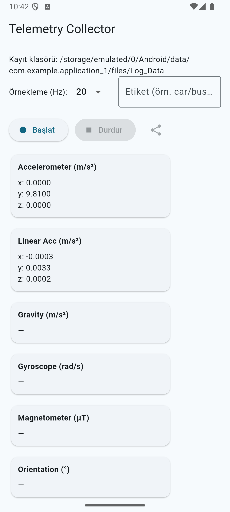
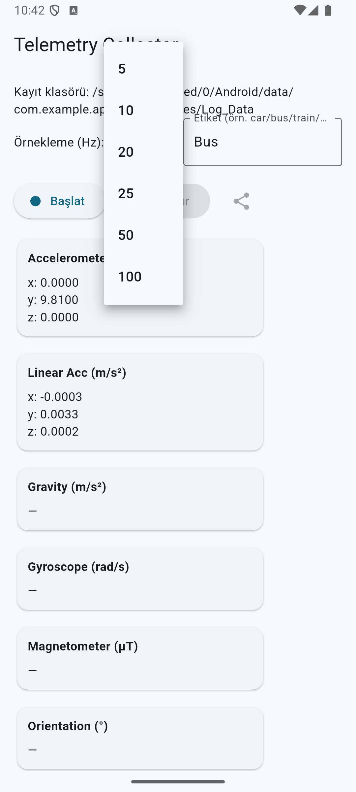
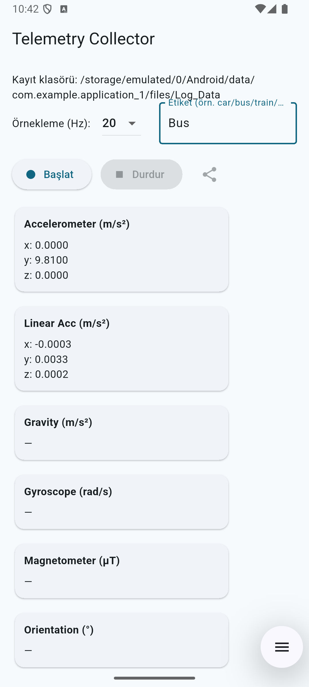
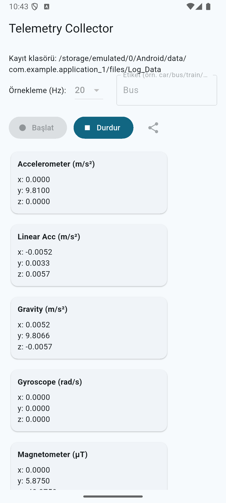
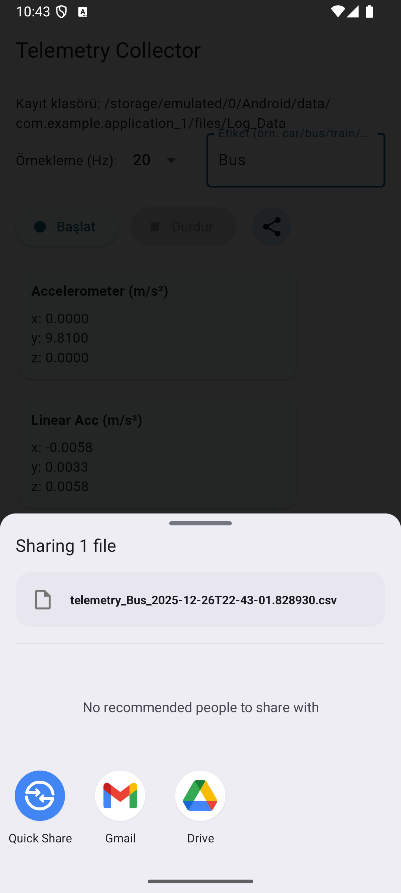

# How to Use the App

Telemetry Collector is a Flutter application that collects real-time sensor data from your device's Inertial Measurement Unit (IMU) for mobility and transportation mode classification (e.g., walking, bus, car, train, etc.).

Below is a step-by-step guide on how to use the application.

### Step 1: Launch the App and View the Main Screen
Open the app. The main screen displays the save path, sampling frequency dropdown, label input field, and Start/Stop controls. Real-time sensor readings are shown below.

### Step 2: Select Sampling Frequency
Tap the dropdown next to "Örnekleme (Hz):" to choose your desired sampling rate (e.g., 5, 10, 20, 25, 50, or 100 Hz). Higher rates provide more detailed data but use more storage.

### Step 3: Enter an Activity Label
In the "Etiket (örn. car/bus/train/...)" text field, type a descriptive label for the activity you are about to record (e.g., "Bus", "Walking", "Car").

### Step 4: Start Data Collection
Tap the "Başlat" (Start) button. It will turn blue and become active while "Durdur" (Stop) becomes enabled. Sensor values will begin updating in real time.

### Step 5: Perform the Activity
While recording, carry your phone as you normally would during the labeled activity (e.g., hold it while riding a bus). The app displays live readings for Accelerometer, Linear Acceleration, Gravity, Gyroscope, Magnetometer, and Orientation.

*(Use any of the recording screenshots here – they all show live data updates)*

### Step 6: Stop Recording and Share the File
When finished, tap the "Durdur" (Stop) button. The app automatically saves the data as a CSV file named like `telemetry_[Label]_[Timestamp].csv` and opens the Android share sheet so you can send or save the file (e.g., via Gmail, Drive, etc.).

Feel free to repeat
